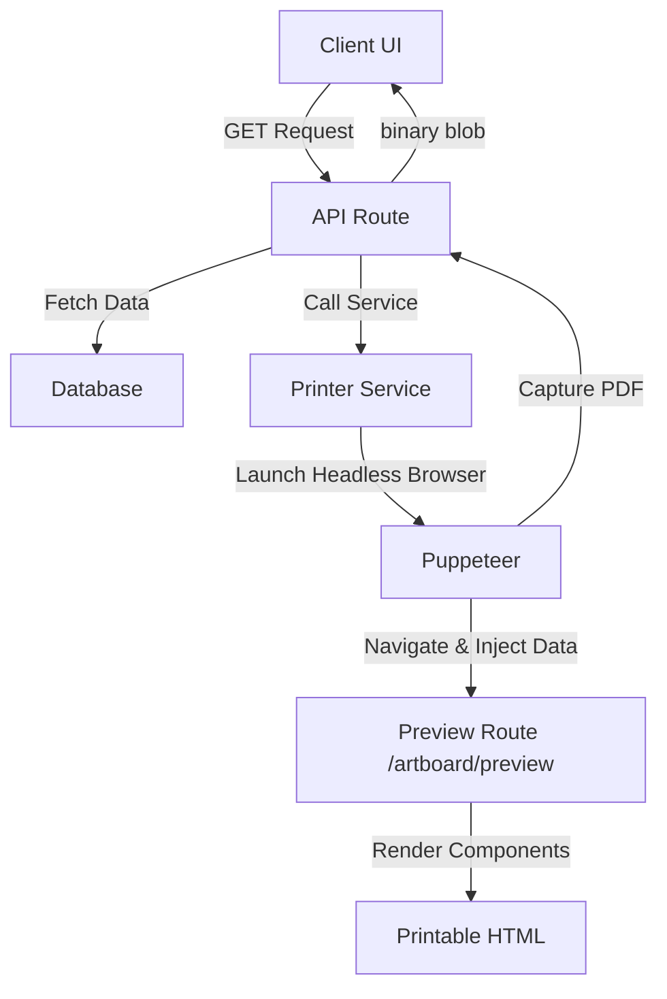

# Blueprint: Headless-Browser PDF Generation Pattern

This steering document outlines a reusable architectural pattern for generating complex PDFs in modern web applications (Next.js/React) using a headless browser.

## 🏹 The Problem
Traditional PDF libraries for Node.js (like `pdfkit` or `jspdf`) require you to manually define coordinates, fonts, and layouts in code. This makes it extremely difficult to maintain complex, responsive designs that match your app's UI.

## 🛡 The Solution: "Render & Capture"
Instead of drawing the PDF, we **browse** to it. We use a headless browser (Puppeteer) to visit a hidden route in our app, inject the necessary data, and capture a "snapshot" of the rendered HTML as a high-quality PDF.

---

## 🏗 High-Level Architecture



### Components needed:
1.  **A Shared Service**: `printer.service.ts` to manage the Puppeteer lifecycle.
2.  **A Preview Page**: A "stateless" React route that only renders UI based on `localStorage` data.
3.  **Dedicated CSS**: Using standard CSS but optimized for A4/Letter dimensions.

---

## 🛠 Step-by-Step Implementation

### 1. The Printer Service (`lib/printer.service.ts`)
This service is responsible for the browser automation. It needs to handle:
- Browser launch/close.
- Navigation to your app's preview URL.
- **The Data Injection Trick**: Injecting JSON into `localStorage` so the React app can pick it up without long query strings.

```typescript
// Important: Inject data into localStorage via Puppeteer
await page.evaluate((data) => {
  localStorage.setItem('print-data', JSON.stringify(data));
}, payload);

// Reload to trigger React hydration with the new localStorage data
await page.reload({ waitUntil: 'networkidle0' });
```

### 2. The Preview Handler (`app/preview/page.tsx`)
Create a route that serves as the "Canvas". It should be:
- **Clean**: No global navbars, sidebars, or footers.
- **Reactive**: Use a `useEffect` to read from `localStorage` on mount.
- **Flexible**: Handle different "types" of documents via a simple switch case.

### 3. The API Endpoint
Your endpoint handles the request, prepares the data, and returns the PDF.
- **Tip**: Set headers like `Content-Type: application/pdf` and `Content-Disposition: attachment; filename="..."`.

---

## 👔 Best Practices & Tips

### 📏 CSS for Printing
- **Paper Size**: Define it in your printable component CSS:
  ```css
  @page {
    size: A4;
    margin: 15mm;
  }
  ```
- **Avoid Cuts**: Use `break-inside-avoid` on table rows or card elements to prevent them from being split across pages.
- **Units**: Use `mm` or `cm` for layout containers to ensure real-world sizing matches the screen.

### 🚀 Infrastructure & Performance
- **Serverless Limits**: Puppeteer is heavy. On Vercel, use a service like `browserless.io` or ensure your function has at least **1GB+ RAM**.
- **Caching**: If the data doesn't change often, cache the generated PDF buffer in a fast storage (like Redis or S3) indexed by a hash of the input data.
- **Timeouts**: Puppeteer can take 3-10 seconds to generate a PDF. Use a "Generating..." state in your UI.

### 🔗 Environment Variables
Always use a `NEXT_PUBLIC_APP_URL` variable. Puppeteer running on the server needs to know its own URL to "visit" the preview page.

---

## ✅ Why use this pattern?
- **Speed**: You build the PDF exactly like you build any other React page.
- **Consistency**: The PDF looks exactly like your web preview.
- **Maintainability**: Designers can edit the "PDF" by just editing React components.

---

## 🛒 Checklist for your next project:
1.  [ ] Install `puppeteer`.
2.  [ ] Create `lib/printer.service.ts`.
3.  [ ] Create `/preview` route.
4.  [ ] Build the printable UI component.
5.  [ ] Set up an API route to fetch data and call the printer.
6.  [ ] Configure `NEXT_PUBLIC_APP_URL` in CI/CD.
